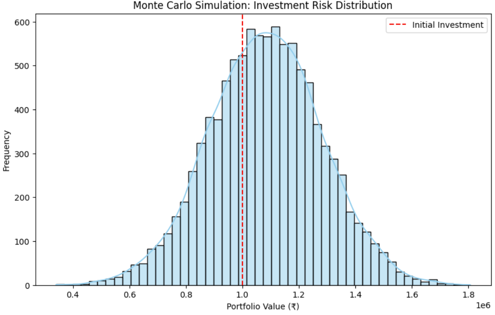
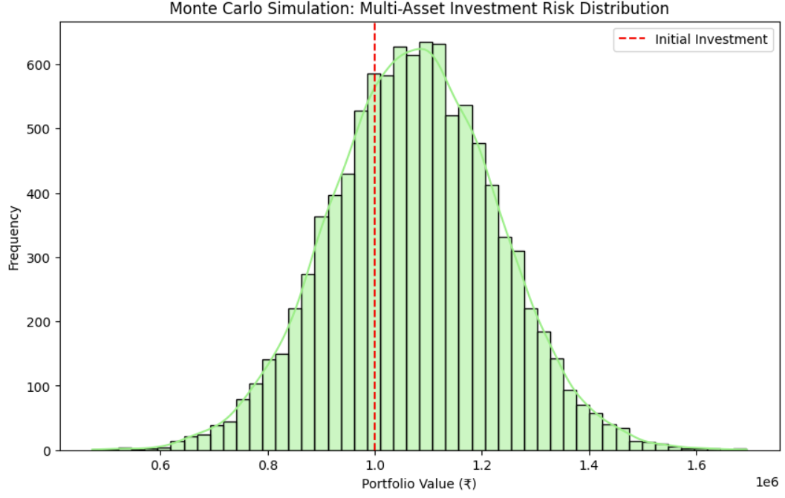

# Investment Risk Simulation using Monte Carlo | Python

## Overview
This project demonstrates how to use **Monte Carlo Simulation** to model financial investment risk.  
It predicts possible portfolio outcomes, calculates key risk metrics, and visualizes single-asset and multi-asset portfolios.

## Tools & Libraries
- **Python**: Programming language  
- **NumPy**: Random number generation and calculations  
- **Pandas**: Data handling  
- **Matplotlib & Seaborn**: Visualizations  

## Project Workflow
1. **Define Investment Parameters**  
   - Initial Investment: ₹10,00,000  
   - Expected Return: 8% (single asset)  
   - Volatility: 20%  
   - Simulations: 10,000  

2. **Run Monte Carlo Simulations**  
   - Generate 10,000 random returns  
   - Calculate portfolio values  

3. **Analyze Results**  
   - Mean portfolio value  
   - Median portfolio value  
   - Probability of loss  

4. **Visualize Portfolio Outcomes**  
   - Histograms and KDE curves  
   - Break-even line highlighted  

5. **Value at Risk (VaR)**  
   - Calculate 95% confidence VaR  

6. **Multi-Asset Portfolio**  
   - Stocks + Bonds with 60:40 weights  
   - Compare single vs multi-asset portfolios  

## Key Learnings
- Monte Carlo simulation provides **risk and return distributions**.  
- **Probability of Loss** and **VaR** quantify investment risk.  
- **Diversification** reduces portfolio risk.  
- Visualizations improve interpretation and decision-making.  

## Results
### Single Asset Portfolio

### Multi-Asset Portfolio

## GitHub Link
[View Notebook](InvestmentRiskSimulation_MonteCarlo.ipynb)
